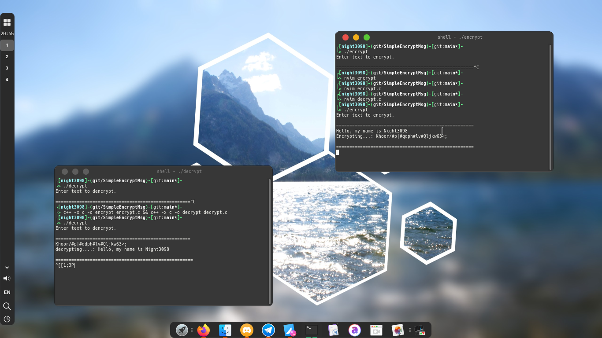

# Simple encrypt/decrypt message

<p align = "center"></p>

# Install

```
git clone https://github.com/night3098/SimpleEncryptMsg
cd SimpleEncryptMsg
c++ -x c -o encrypt encrypt.c
c++ -x c -o decrypt decrypt.c
```

# Use

```
./encrypt
./decrypt
```
